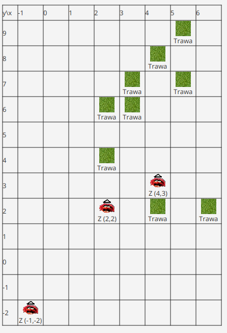

# Laboratorium 8

Celem raboratorium jest zapoznanie się z mechanizmem wątków oraz obsługą zasobów w kontekście programowania 
graficznego interfejsu użytkownika (GUI).

## Przydatne informacje

### Wątki

* Mechanizm wątków służy do realizacji zadań, które powinny być realizowane współbieżnie, a jeśli system posiada wiele
  procesorów, to również równolegle. Wykonujące wątki na wzajem nie blokują swego wykonania.
  Dzięki temu możliwe jest np. reagowanie na zdarzenia GUI (np. kliknięcie na guzik) oraz wykonywanie obliczeń, które
  sterują tym co wyświetla się w GUI.
* Przykładami takich operacji może być np. dostęp do zasobu sieciowego albo w naszym przypadku sztucznie generowane opóżnienie pomiędzy ruchami.
* Wątek UI jest to główny wątek aplikacji w graficznym interfejsem użytkownika. Tylko ten wątek może modyfikować zawartość sceny w *JavaFX*.
* Aby stworzyć wątek możemy skorzystać z klasy `Thread` i interfejsu `Runnable`.
    ```java
    class SimulationEngine implements Runnable {
        @Override
        public void run() {
            System.out.println("Thread started.");
        }
    }
    
    SimulationEngine engine = new SimulationEngine();
    Thread engineThread = new Thread(engine);
    engineThread.start();
    ```

### Dostęp do zasobów

* Zasoby w projkecie, takie jak obrazy graficzne zwykle umieszczane są w katalogu `src/main/resources`.
* Odczytanie zasobu możliwe jest np. za pomocą strumienia `java.io.FileInputStream`.
* Dane binarne zawierające obraz można wczytać do obiektu `javafx.scene.image.Image`.
* Wyświetlenie obrazka odbywa się za pomocą obiektu `javafx.scene.image.ImageView`.
* Zasoby takie jak `ImageView` są pamięcichłonne, dlatego ważne jest aby nie były one tworzone bez potrzeby. 
  W modelu pamięciowym JavaFX elementy, które nie należą do drzewa węzłów są usuwane przez śmieciarza (GC),
  ale ich tworzenie samo w sobie jest czasochłonne, co może istotnie spowalniać działanie aplikacji.
* Przykładowy kod służący do utworzenia obrazka, który można dodać do sceny JavaFX:
    ```java
    Image image = new Image(new FileInputStream("src/main/resources/up.png"));
    ImageView imageView = new ImageView(image);
    imageView.setFitWidth(100);
    imageView.setFitHeight(100);
    ```

## Zadania do wykonania

[Instrukcja do początkowej części ćwiczenia](../lab7/gui.md)


### Tekstury

1. Stwórz albo wykorzystaj gotowe 4 tekstury z informacją o orientacji dla zwierzaka (folder `resources`)
2. Stwórz albo wykorzystaj teksturę dla trawy.
3. Dodaj utworzone tekstury do folderu `src/main/resources`
4. Utwórz klasę `GuiElementBox`, która pozwoli na dodanie obrazka do siatki:
    * utwórz instancję klasy `Image`,
    * zainicjuj za jej pomocą obiekt `ImageView`,
    * ustal jego rozmiary na 20 x 20,
    * utwórz etykietę informującą o pozycji zwierzaka,
    * uwtórz obiekt *vertical box* (`VBox`) do którego dodasz oba obiekty (obrazek i etykietę),
    * wyśrodkuj elementy wewnątrz kontenera.
5. Dodaj do interfejsu `IMapElement` metody pozwalające na pobranie nazwy zasobu odzwierciedlającego wygląd danego elementu (czyli np.
   `src/main/resources/up.png`, jeśli zwierzę zwrócone jest na północ). Zaimplementuj je w klasach implementujących ten
   interfejs.
6. Wykorzystaj powyższe metody w konstruktorze klasy `GuiElementBox`, który powinien przyjmować instancję `IMapElement`
   i wyświetlać reprezentację elementu. Upewnij się, że elementy te nie są niepotrzebnie tworzone wielokrotnie.
7. Zamień reprezentację tekstową na graficzną w klasie `App`.
8. Docelowy wygląd:<br>


### Wątek symulacyjny
1. Skorzystaj ze wzroca *Observer*, aby informować o zmianach położenia zwierzą moduł GUI. Zastanów się, czy lepiej
   połączyć za jego pomocą zwierzęta i GUI, czy może silnik symulacyjny.
2. W klasie `App` obsłuż aktualizację stanu mapy. Wyczyść siatkę wywołując `grid.getChildren().clear()` i 
   wyrenderuj ją od nowa wyświetlając aktualne pozycje roślin i zwierząt. Wykonanie na wątku UI można osiągnąć przy użyciu wywołania `Platform.runLater(() -> { ... })`.
    * **Dla zaawansowanych:** Spróbuj zopytmalizować aktualizacje siatki aby nie była ona tworzona od nowa za każdym razem.
4. Dodaj pole `moveDelay` które będzie służyć do opóźniania sekwencji ruchów zwierząt (aby widzieć zmiany na żywo).
    * Zastanów się kiedy ustawić wartość tego pola.
5. Opóźnienie pomiędzy ruchami dodaj za pomocą `Thread.sleep(300)` (usypia wątek na 300 ms). 
   Umieść `sleep()` w bloku `try-catch` i wypisz stosowny komunikat w razie przerwania symulacji.
6. Zaimplementuj interfejs `Runnable` przez `SimulationEngine`.
7. W metodzie `init()` GUI stwórz nowy wątek używając `SimulationEngine` jako parametru. Uruchom wątek metodą `start()`. 
   Pamiętaj o ustawieniu `moveDelay` na np. 300 [ms].

### Inne elementy interfejsu
1. Dodaj do interfejsu pole tekstowe i przycisk start. Skorzystaj z klas [`HBox`](http://tutorials.jenkov.com/javafx/hbox.html), [`VBox`](http://tutorials.jenkov.com/javafx/vbox.html), [`Button`](http://tutorials.jenkov.com/javafx/button.html) i [`TextField`](http://tutorials.jenkov.com/javafx/textfield.html).
2. Utwórz setter dla pola `directions` w `ThreadedSimulationEngine` tak, aby dało się je dynamicznie zmieniać przy naciśnięciu przycisku. Utwórz konstruktor który nie ustawia tego pola.
3. Usuń `engineThread.start()` z metody `init()`.
4. Dodaj obsługę kliknięcia *Start* (użyj `setOnAction`). Odczytaj wartość pola tekstowego (`getText()`) i użyj jego zawartości w parserze. 
   Ustaw nową sekwencję ruchów i uruchom **za każdym razem** nową instancję `Thread`.
