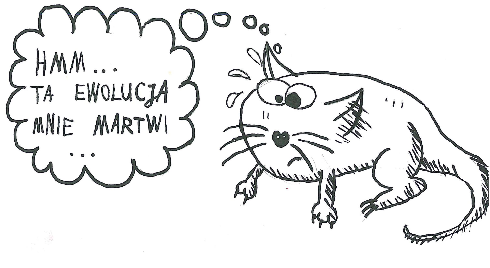
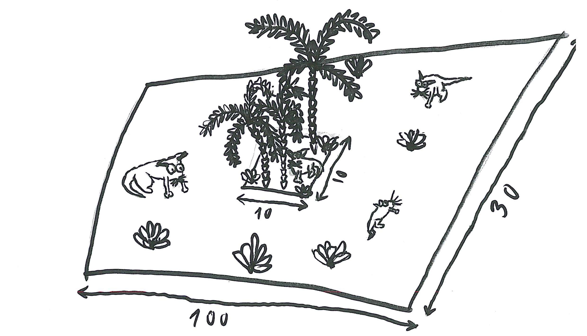
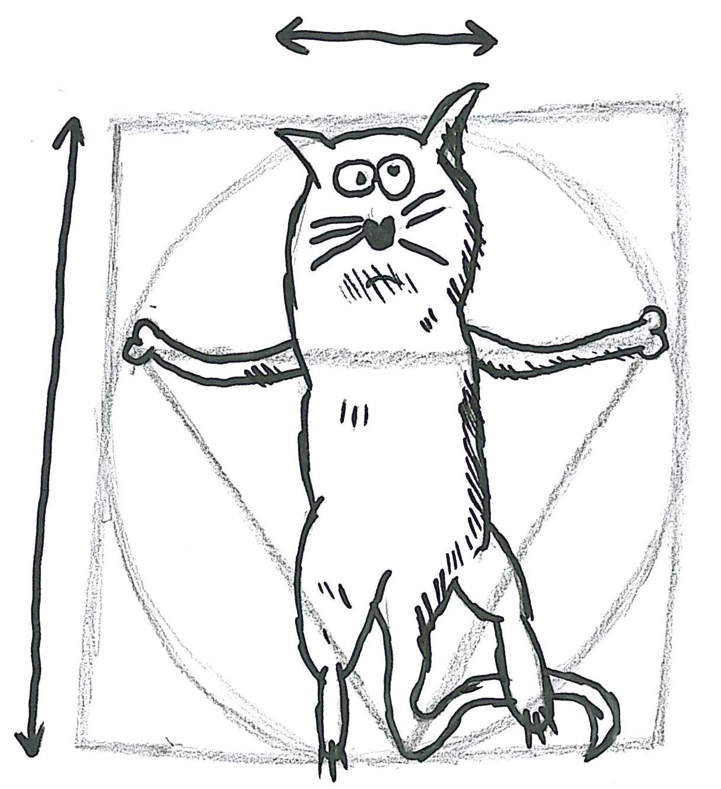
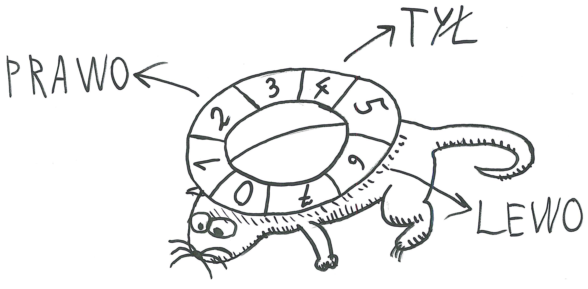

# Projekt nr 1 - generator ewolucyjny

Niniejsza treść została zaadaptowana na podstawie opisu oraz ilustracji przygotowanych przez Wojciecha Kosiora.
Inspiracją dla niego była z kolei książka "Land of Lisp" Conrada Barskiego, który zaś zainspirował się artykułem w
"Scientific American" :-)

## Formularz z linkiem do repozytorium

https://forms.gle/wCFZecEAk81VAYTM8

## Termin oddania projektu

* 21.12.2021 godz. 23:59:59 CET - normalny termin oddania projektu
* 23.12.2021 godz. 23:59:59 CET - późny termin oddania projektu tzn. -2 krwinki

## Cel projektu

Stwórzmy grę! Nie będzie to jednak gra, w którą my gramy. Zamiast tego będzie
to świat, który ewoluuje na naszych oczach! Stworzymy środowisko stepów
i dżungli ze zwierzętami, które biegają, buszują w zaroślach, jedzą i rozmnażają
się. A po kilka milionach lat zobaczymy, że wyewoluowały w różne gatunki!

Świat naszej gry jest niezmiernie prosty. Składa się ze zwykłej, prostokątnej
połaci, której brzegi zawijają się na drugą stronę[^1]. Większość świata pokrywają
stepy, na których rośnie niewiele roślin stanowiących pożywienie zwierząt. Na
środku świata znajduje się niewielka dżungla, gdzie rośliny rosną dużo szybciej. 

[^1]: Docelowa implementacja obejmuje dwa warianty mapy.

Nasze zwierzęta, które są roślinożercami, będą przemierzały ten świat w poszukiwaniu pożywienia. Każde zwierzę ma
określoną energię, która zmniejsza się co dnia. Znalezienie i zjedzenie rośliny zwiększa poziom energii o pewną wartość.

Rośliny będą wyrastały w losowych miejscach, ale ich koncentracja będzie większa w dżungli niż na stepie. Codziennie w
naszym świecie pojawią się dwie nowe rośliny – jedna w każdej ze stref.

## Anatomia zwierzęcia

Musimy śledzić kilka cech każdego zwierzęcia. Po pierwsze, zarówno w przypadku rośliny jak i tych, którzy je zjadają,
musimy znać koordynaty `x` i `y`. Wskazują nam one, gdzie dane zwierzę lub roślina jest na mapie.  Musimy także wiedzieć,
ile energii ma dane zwierzę. To Darwinowska gra o przetrwanie, więc jeśli zwierzątko nie zdoła zdobyć odpowiedniej ilości
pożywienia, będzie głodować i umrze. Atrybut "energia" mówi nam, ile dni zostało jeszcze danemu zwierzątku. Musi ono
koniecznie znaleźć więcej jedzenia, zanim zapas energii się wyczerpie.  Musimy także pamiętać, w którą stronę zwrócone
jest zwierzę. Jest to ważne, ponieważ będzie ono przechodzić na sąsiedni kwadracik na mapie świata każdego dnia. Jest
osiem różnych możliwych obrotów.

Obrót `0` oznacza, że zwierzę nie zmienia swojej orientacji, obrót `1` oznacza, że zwierzę obraca się o 45°, `2`, o 90°,
itd. Przykładowo, jeśli zwierzę było skierowane na północ i obrót wynosi `1`, to zwierzę skierowane jest na
północny wschód. 

Na koniec musimy także przechowywać geny zwierzaka. Każde zwierzę ma 32 geny składające się z jednej liczby w zakresie od 0 do 7 
(0 oznacza ruch w przód, 4 ruch w tył, a pozostałe geny reprezentują obrót: 1 - obrót o 45 stopni w prawo, itd.).
Te geny reprezentują preferencje zwierzęcia względem określonego obrotu. Każdego dnia zwierzę zadecyduje czy dalej
podążać w tym samym kierunku, czy skręcić i zwrócić się w inną stronę. Zrobi to na podstawie tych genów i losowo
wybierze nowy kierunek. Szansa na wybranie odpowiedniego obrotu jest proporcjonalna do liczby genów reprezentujących
go. Weźmy jako przykład zwierzę z genami:

`0 0 0 0 0 0 0 0 1 1 2 2 2 2 2 2 3 3 4 4 4 4 4 4 5 5 6 6 7 7 7 7`

To zwierzę najbardziej preferuje brak obrotu (p=0.25), na drugim miejscu jest obrót w prawo (`2`) oraz ruch w tył (`4`)
(p=0.1875), następny w kolejności jest obrót o 315 stopni (p=0.125). Pozostałe obroty mają takie samo prawdopodobieństwo (p=0.0625).

## Konsumpcja i rozmnażanie

Jedzenie jest prostym procesem. Zakładamy, że zwierzę zjada roślinę, gdy stanie na jej polu, a jego energia wzrasta
wtedy o zdefiniowaną wartość.

Rozmnażanie jest zwykle najciekawszą częścią każdej symulacji ze zwierzętami. Zdrowe młode może mieć tylko zdrowa para
rodziców, dlatego nasze zwierzęta będą się rozmnażać tylko jeśli mają odpowiednią ilość energii. Przy reprodukcji
rodzice tracą na rzecz młodego jedną czwartą swojej energii. 

Urodzone zwierzę otrzymuje genotyp będący krzyżówką genotypów rodziców. Udział genów jest proporcjonalny do energii
rodziców i wyznacza miejsce podziału genotypu. Przykładowo, jeśli jeden rodzic ma 50, a  drugi 150 punktów energii, 
to dziecko otrzyma 25% genów pierwszego oraz 75% genów drugiego rodzica. Udział ten określa miejsce przecięcia genotypu,
przyjmując, że geny są uporządkowane. W pierwszym kroku losowana jest strona genotypu, z której zostanie wzięta część 
osobnika silniejszego, np. *prawa*. W tym przypadku dziecko otrzymałoby odcinek obejmujący 25% *lewych* genów
pierwszego rodzica oraz 75% *prawych* genów drugiego rodzica. Jeśli jednak wylosowana byłaby strona *lewa*, to dziecko 
otrzymałoby 75% *lewych* genów silniejszego osobnika oraz 25% *prawych* genów.

## Symulacja

Symulacja każdego dnia składa się z kilku kolejnych akcji:
* usunięcie martwych zwierząt z mapy,
* skręt lub przemieszczenie każdego zwierzęcia (wykonanie ruchu odbywa się tylko, jeśli wylosowany kierunek to przód lub
  tył, w przeciwnych przypadkach zwierzę wyłącznie skręca),
* jedzenie (roślina jest zjadana przez zwierzę posiadające najwięcej energii lub kilka najsilniejszych zwierząt, jeśli więcej niż jedno
  posiada taką samą, największą energię; w takim przypadku energia rośliny jest dzielona),
* rozmnażanie zwierząt (rozmnażają się zawsze dwa zwierzęta o najwyższej energii na danym polu; jeśli występuje więcej zwierząt o tej
  samej energii, wybór jest losowy),
* dodanie nowych roślin do mapy.

Oczywiście na początku symulacji na środku świata umieszczamy kilka zwierząt (Adam/Ewa). Liczba zwierząt na początku
jest parametrem symulacji.

## Szczegółowe wymagania

1. Program ma wyświetlać animację pokazującą pozycje zwierząt, ich energię w dowolnej formie (np. koloru) oraz pozycje
   roślin.
2. Animacja ma być realizowana z użyciem graficznego interfejsu użytkownika z wykorzystaniem biblioteki JavaFX.
3. Program musi umożliwiać zatrzymywanie oraz wznawianie animacji w dowolnym momencie (niezależnie dla każdej mapy -
   patrz niżej).
4. Program ma pozwalać na śledzenie następujących statystyk dla aktualnej sytuacji w symulacji - w przypadku wartości
   liczbowych, wizualizacja ma być przedstawiona jako wykres aktualizowany na bieżąco:
   * liczby wszystkich zwierząt,
   * liczby wszystkich roślin,
   * dominujących genotypów (dominanta z genotypów, a nie genów),
   * średniego poziomu energii dla żyjących zwierząt,
   * średniej długości życia zwierząt dla martwych zwierząt (wartość uwzględnia wszystkie nieżyjące zwierzęta - od
     początku symulacji),
   * średniej liczby dzieci dla żyjących zwierząt (wartość uwzględnia wszystkie powstałe zwierzęta, a nie tylko
     zwierzęta powstałe w danej epoce).
5. Po zatrzymaniu programu można:
   * wskazać pojedyncze zwierzę, co powoduje wyświetlenie jego genomu,
   * wskazać pojedyncze zwierzę, w celu śledzenia jego historii (śledzenie rozpoczyna się w danym momencie, więc nie
     uwzględnia wcześniejszych dzieci, ani potomków; wartości mają być aktualizowane na bieżąco):
     * określenia liczby wszystkich dzieci,
     * określenia liczby wszystkich potomków,
     * określenia epoki, w której zmarło,
   * wskazać wszystkie zwierzęta z dominującym genomem,
   * zapisanie statystyk do pliku (punkt 7).
6. Program ma umożliwić wyświetlenie symulacji jednocześnie na dwóch mapach. Mapa lewa jest "zawinięta" - zwierzęta 
   po dojściu do granicy, przechodzą na jej przeciwną
   stronę. Prawa mapa posiada "mur" - dojście do muru i wykonanie ruchu w jego kierunku powoduje, ze zwierzę się nie
   przemieszcza ("traci kolejkę").
7. Dla każdej mapy program umożliwia wybranie jednej z 2 zasad ewolucyjnych: zwykła oraz "magiczna". W strategii
   magicznej, jeśli liczba zwierząt na całej mapie wynosi 5, to 5 nowych zwierząt pojawia się na
   losowych, niezajętych pozycjach. Zwierzęta te są kopiami zwierząt już występujących na mapie (tzn. otrzymują ich genotyp), 
   ale mają pełną energię początkową. Sytuacja ta może powtórzyć się 3 razy i jest sygnalizowana w interfejsie użytkownika
   odpowiednim komunikatem.
7. Statystyki symulacji mają być zapisywane do pliku w formacie CSV. Zapisanie odbywa się niezależnie dla każdej mapy.
   Statystyki mają obejmować parametry z punktu 4 (z pominięciem dominującego genotypu). Każdy wiersz obejmuje
   pojedynczą epokę. Na końcu pliku mają pojawić się wartości uśrednione.
8. Uruchomienie programu musi być możliwe za pomocą komendy Gradla. Implikuje to, że zależności aplikacji muszą być
   obsługiwane za pomocą Gradle'a.

[Często zadawane pytania](faq.md)

# Przykładowe implementacje

Uwaga: przedstawione implementacje niekoniecznie spełniają wymaga przestawione w sekcji "Szczegółowe wymagania".

* https://www.youtube.com/watch?v=4FangGEpwe4
