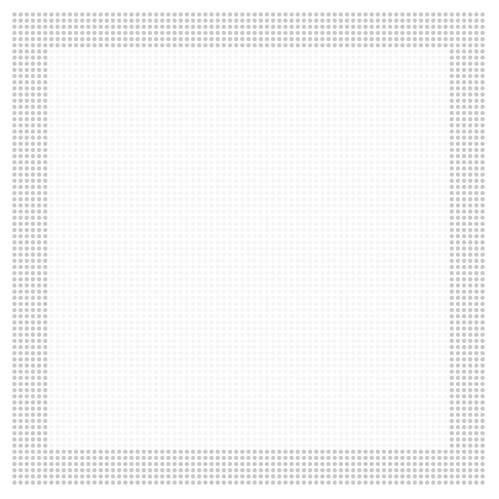
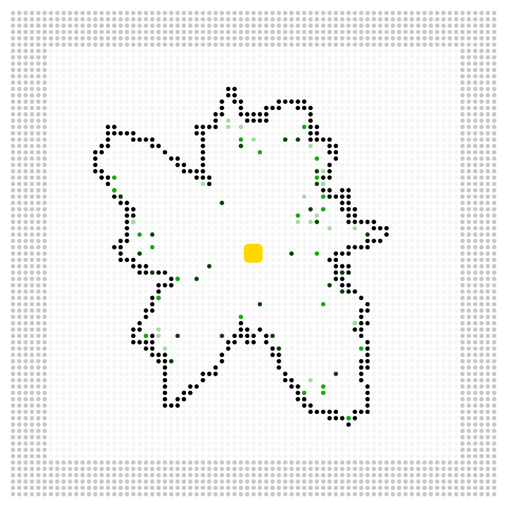
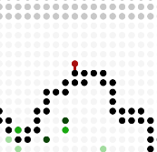
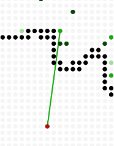
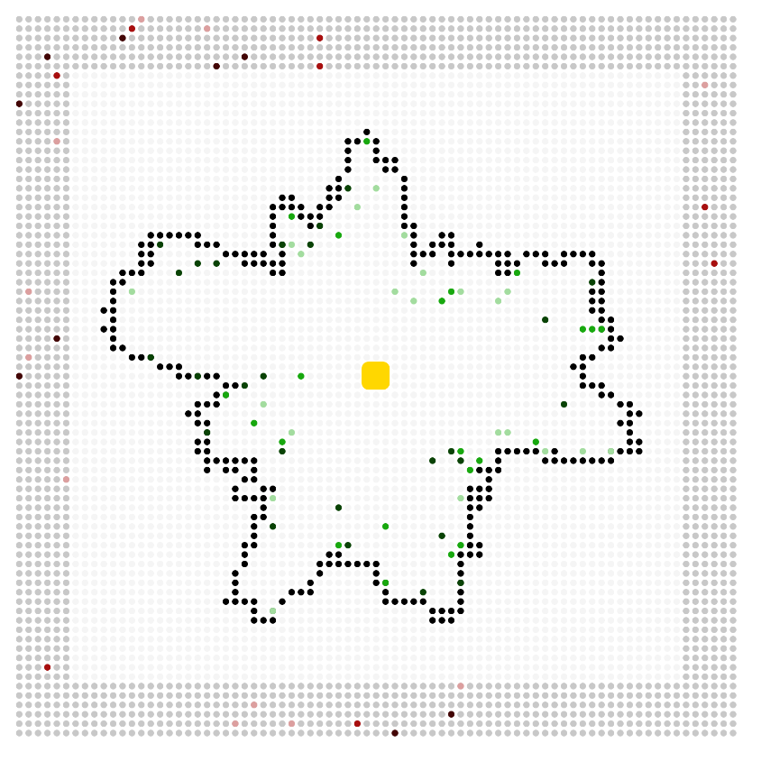

# Atak na wioskę

Za projekt można dostać 8 punktów za samodzielne wykonanie i 6 punktów za wykonanie w parze.

## Wstęp

Celem projektu jest stworzenie gry, w której wcielamy się w nekromantę. Jako zły nekromanta chcemy zniszczyć wioskę. Do tego celu użyjemy umarlaków powowyławych do życia za pomocą czarnej magii. Wioska ma jednak swoich obrońców dlatego atak trzeba mądrze rozplanować.

## Mapa

Mapa składa się z pól na których może znajdować się fragment muru, potwór lub obrońca. Kształt całej mapy to kwadrat o nieparzystej długości boku. Poszczególne obiekty na mapie powinny być oznaczone różnymi kolorami lub grafikami.

Mapa podzielna jest na dwa obszary: 
- obszar wioski - zajmuje ~70% powierzchni mapy i jest kwadratem ze środkiem w centrum mapy
- obszar potworów - pozostała część mapy.
Na ilustarcji ciemniejszym kolorem zaznaczono obszar potworów, a jaśniejszym obszar wioski.

Mur powinien być generowany proceduralnie, to znaczy kształt muru ma być tworzony losowo podczas każdego uruchamiania programu. Nie ma ograniczeń co do jego kształtu, musi jednak:
- być zamknięty
- być za każdym razem inny
- nie wychodzić poza obszar wioski

Obrońcy umieszczani są w losowo wybranych pozycjach w okolicach muru i zawsze w jego wnętrzu. Klasa obrońcy wybierana jest losowo.

Wygenerowana mapa może wyglądać na przykład tak:

Do wygenerowania mapy można wykorzystać *Szum Perlina*, żeby uzyskać zamknięty mur warto wykorzystać metodę z tego [filmu](https://www.youtube.com/watch?v=ZI1dmHv3MeM).

## Potwory

W każdej turze poruszają się o właściwą dla swojej klasy liczbę pól w kierunku centrum mapy. Wszystkie potwory poruszają się w linii prostej. Jeśli na ich drodze stanie mur to zatrzymują się przed nim i go atakują. Raz na ilość tur określoną przez *częstotliwość ataku* potwór odbiera fragmentowi muru *moc ataku* punktów życia. Atak powinien być przedstawiony w sposób graficzny, na przykład poprzez połączenie linią potwora i fragmentu muru, który atakuje.

Są trzy klasy potworów. Przykładowe nazwy:
- zombie
- wilkołak
- mumia

Charakteryzuje je:
- prędkość ruchu
- moc ataku
- częstotliwość ataku
- punkty życia

## Obrońcy

Nie poruszają się, mogą jednak atakować potwory z dystansu. Atakują co ilość tur określoną przez *częstotliwość ataku* i zadają *moc ataku* punktów w jednym strzale. Nie mogą atakować potworów znajdujących się w obszarze potworów, nawet jeśli są w zasięgu. Potwory nie mogą bezpośrednio zaszkodzić obrońcom, ich celem jest tylko przerwanie muru i dostanie się do centrum mapy. Atak obrońcy powinien być oznaczony w sposób graficzny na przykład przez połączenie linią potwora i obrońcy.

Są trzy klasy obrońców. Przykładowe nazwy:
- łucznik
- mag
- kusznik

Charakteryzuje ich:
- moc ataku
- częstotliwość ataku
- zasięg

## Mur

Mur nie wykonuje żadnych akcji. Każde pole muru cechuje pewna ilość punktów życia. Pola muru nie są połączone i atak jednego nie wpływa na punkty życia drugiego. Pole muru, któremu skończy się życie znika i potwory mogą przez nie przechodzić.

## Zamek

Znajduje się w centrum mapy i kiedy któryś potwór do niego dotrze gra się kończy.

## Rozgrywka

Gracz rozpoczyna grę z pewną ilością złota, za które może kupić potwory, a następnie umieścić je na mapie w obszarze potworów. Przykład rozstawienia:

Po rozstawieniu wszystkich potworów włącza symulację przyciskiem "Start". Potwory idą do centrum mapy, a obrońcy je atakują. Jeśli który potwór przebije się przez mur i dojdzie do centrum to gracz wygrywa. Jeśli wszystkie potwory zginą to przegrywa.

Symulacja podzielona jest na tury, z których każda wygląda w następujący sposób:
1. Ruch potworów
1. Strzały obrońców (jęśli któryś potwór jest w zasięgu)
1. Atak muru przez potwory (jeśli któryś potwór jest przy murze)
1. Sprawdzenie czy potwory wygrały

## Grafika

Przed bitwą interfejs graficzny pozwala zobaczyć posiadaną ilość złota, umożliwia zakup potworów i rozstawienie ich na mapie.

Reprezentacja graficzna bitwy polega na narysowaniu mapy w kolejnych turach. Kolejne tury następują po sobie z niewielkim odstępem czasowym.

Wszystkie elementy mapy muszą być rysowane na ekranie w sposób, który umożliwia ich rozróżnienie. Może to być osiągnięte za pomocą różnych kolorów lub obrazków. Ataki muszą być zaznaczone, tak żeby było widać, który obrońca atakuje którego potwora, oraz który potwór atakuje który fragment muru.