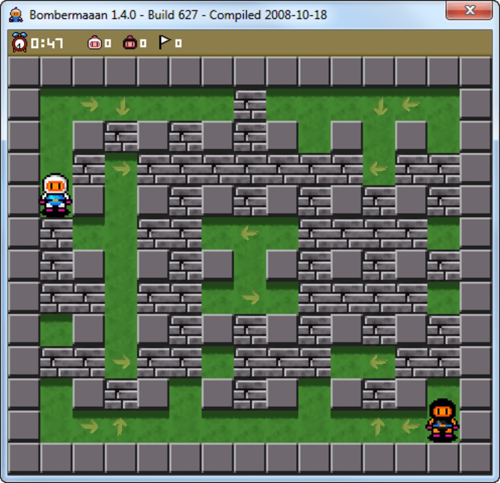

# Bomberman

## Punktacja

Wersja podstawowa: 2

Wersja z power-upami: 3

## Opis ogólny

Bomberman jest grą multiplayer, w której gracze wcielają się w tytułowego bombermana - człowieka wysadzającego bomby. Celem gry jest wyeliminowanie pozostałych graczy poprzez trafianie ich wybuchami stawianych przez gracza bomb.

## Mapa

Gra realizowana jest na mapie 2d w postaci labiryntu, w którym postacie mogą poruszać się w czterech kierunkach (góra, dół, lewo, prawo). Postacie na początku gry powinny pojawiać się w przeciwnych rogach mapy. Labirynt ograniczony jest nieprzekraczalnymi oraz niezniszczalnymi ścianami. Wewnątrz, labiryt powinien być wypełniony ścianami takimi jak opisano wyżej, o wymiarach 1x1, mającymi dokładnie 1 pole odstępu od ich sąsiadów. Pomiędzy tymi ścianami powinny znajdować się blokujące przejście skrzynie, które można zniszczyć bombami. Skrzynie nie powinny znajdować się bliżej niż 2 pola od rogów planszy.

### Obraz jest jedynie poglądowy i ma przedstawiać ogólną ideę mapy. Elementów, które nie znajdują się w tym opisie nie należy implementować. 

## Bomby

Główną umiejętnością każdej postaci jest postawienie zapalonej bomby na polu na którym stoją. Bomba po kilku sekundach wybucha, wysyłając widoczny w grze promień we wszystkich wcześniej wymienionych kierunkach. Promienie te mają zasięg 1 (powinny obejmować 5 pól - pole, na którym stała bomba, oraz sąsiednie) i zatrzymują się po napotkaniu na ich torze ściany. Każdy gracz trafiony przez promień traci jedno życie. Limit postawionych jednocześnie bomb dla każdego gracza wynosi 1.

## Warunki gry

Każdy gracz posiada 3 życia. Wariunkiem przegranej jest utrata wszystkich żyć. Warunkiem wygranej jest wyeliminowanie innych graczy z gry.

## Obsługa gry

Gra powinna obsługiwać tryb dwuosobowy. Sterowanie postacią odbywa się przez przyciski klawiatury (np. W, A, S, D oraz strzałki do poruszania się graczy, a Z oraz M do stawiania bomb).

## Wariant z power-up'ami

W wariancie z power-up'ami każda skrzynia ma 30% szans na zostawienie w jej miejscu losowego power-up'a po jej zniszczeniu. Power-up'y może podnieść dowolny gracz wchodząc na pole, na którym się znajduje. Po podniesieniu przez gracza power-up'a powinien on zniknąć i nie być już dłużej dostępny dla innych graczy. 

## Rodzaje power-up'ów

### Przesuwanie bomb

Po postawieniu bomby gracz może wysłać ją w kierunku, w którym aktualnie jest zwrócony. W takim wypadku bomba przesuwa się o 3 pola do przodu. Jeżeli na ostatnim z tych pól znajduje się przeszkoda, bomba powinna przesuwać się dalej, aż do napotkania pierwszego wolnego pola. Aby pchnąć bombę należy ponownie wcisnąć przycisk jej stawiania.

### Dodatkowa kieszeń

Po podniesieniu przez gracza tego power-up'a, limit jego jednocześnie postawionych bomb wzrasta o 1.

### Przyspieszenie

Ten power-up zwiększa prędkość poruszania się gracza.

### Niewrażliwość

Ten power-up daje chwilową (na 7 sekund) ochronę przed obrażeniami. Oznacza to, że bomby nie zabierają w tym czasie graczowi żyć.

### Przenikanie

Ten power-up pozwala graczowi na przenikanie przez wewnętrzne ściany oraz skrzynie na mapie przez pierwsze 7 sekund po jego podniesieniu. Nie może on jednak stawiać bomb na przeszkodach oraz nie staje się on w tym czasie niewrażliwy na obrażenia. 
