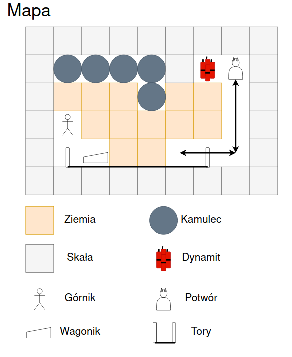

#Górnik

## Punktacja

3

##Cel gry
Doprowadzić wagonik na drugą stronę toru kolejowego, po drugiej stronie planszy

##Opis gry
Gracz wciela się w górnika, którego zadaniem jest zbudowanie połączenia kolejowego przez górę, reprezentowaną jako kwadratowa mapa. Na mapie rozróżniamy kilka typów bloków:
  - Ziemia - gracz może wchodzić na pole z nią, wykopując ją. Wykopana ziemia znika z planszy do czasu restartu poziomu
  - Skała - nie możliwa do wykopania żadnym sposobem
  - Kamulce - spadające i przesuwne bloki, mogące zabić gracza i potwory. Kamulec nie może zostać wykopany przez gracza, ale może zostać wysadzony w powietrze. Kamulec zaczyna spadać, gdy conajmniej jeden z jego sąsiednich bloków pod nim jest pusty. Tzn. jeżeli lewy dolny sasiad kamulca zostanie zniszczony to kamulec będzie chciał się tam zsunąć (preferując oczywiście spadanie prosto w dół jeżeli to możliwe). Gracz po wykopaniu ziemi pod kamulcem jeszcze "trzyma" go, przez co kamulec nie zaczyna spadać dopóki gracz się nie ruszy. Jednak w trakcie spadania, kontakt gracza lub potwora z kamulcem kończy się jego śmiercią. Kamulec można przesuwać analogicznie do wagonika
  - Dynamit - możliwy do podniesienia przedmiot, znajdujący się na mapie. Po podniesieniu trafia do  naszego ekwipunku i jest możliwy do podłożenia w dowolnym miejscu. Po podłożeniu niszczy wszystkie sąsiendie zniszczalne bloki i zabija sąsiednie istoty.
  - Wagonik - możliwy do popychania z obu stron przez gracza, pod warunkiem, że nie jest z drugiej strony blokowany przez bloki lub potwory.
  - Tory - dotarcie wagonika na ich drugą stronę wygrywa poziom
  - Potwór - zabija gracza przy kontakcie; porusza się po prezdefiniowanych ścieżkach, jeśli na ścieżce napotka przeszkodę niemożliwą do przekroczenia, zaczyna zawracać.
  - Górnik - sterowany przez gracza strzałkami lub WSAD, jego śmierć oznacza przegraną poziomu i wymusza jego restart.

##Szczegółowe wymagania
Gra powinna zawierać:
  - Co najmniej 10 poziomów
  - Menu wyboru poziomów
  - Możliwość restartu poziomu w trakcie jego przechodzenia
