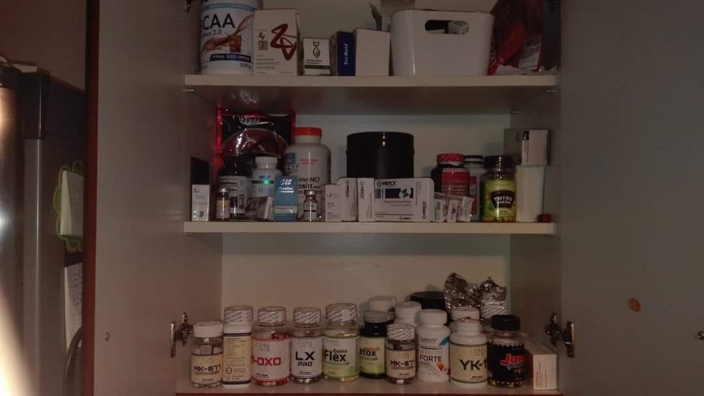
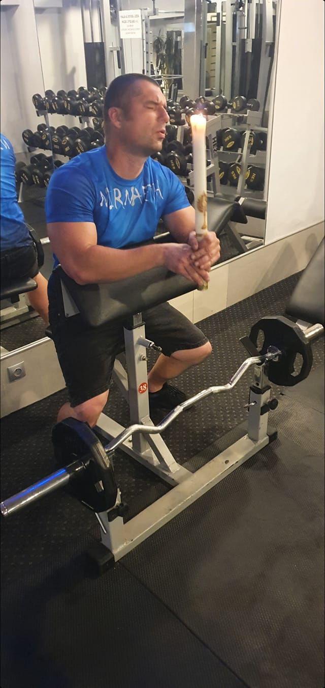

# WMZ - Wąż Machający Żelazem

## Cel projektu

Celem projektu jest zrobienie gry bazowanej na klasycznym snake'u. Nie będzie to jednak zwykły wąż - nasz jest fanem sterydów anaboliczno-androgennych - czyli szeroko pojętych treningów. Gminna wieść niesie, że wąż jest absolwentem kierunku "kulturystyka" na wydziale wszystkiego dobrego UJ.

## Opis mapy

Mapa gry jest kwadratem o zadanych wymiarach N x N. Jest ona wiernym odwzorowaniem siłowni, dlatego też na niej będą pojawiać się konkretne przedmioty.

## Przebieg gry

Gra rozpoczyna się z wężem na redukcji - wąskim chuderlakiem który porusza się bardzo powoli [V = 1]. Wąż pojawia się w losowym miejscu, a wraz z nim kilka innych przedmiotów (nie mogą się one pojawiać w miejscach zajmowanych przez węża).

Wąż w każdym interwale czasowym porusza się jedną kratkę do przodu - tam gdzie jest skierowana jego głowa - lub też zmienia swoją orientację (w sensie lewo/prawo). W momencie zmiany orientacji nie porusza się - jak powszechnie wiadomo głowa u kulturystów nie odznacza się za bardzo od korpusu, więc różnicy nie widać.

Wąż porusza się mapie i wchodzi w interakcje z przyrządami treningowymi i rozmaitymi środkami wspomagającymi. Z przyrządów korzysta od razu, a środki tymczasowo magazynuje na później.

Specjalna akcja następuje gdy głowa węża dotknie odwłoku (z zadanym offsetem P kratek [tj. odwłok traktujemy jako P ostatnich kratek węża]). Wtedy następuje iniekcja wszystkich oczekujących środków, co może się wiązać z przekroczeniem dawki śmiertelnej LD.

Po udanej iniekcji nasz wąż rozszerza się - tj. jego szerokośc nie wynosi już 1 kratki - rośnie proporcjonalnie z obu stron (3, 5, 7... kratek). Należy zaznaczyć, że głowa również wtedy robi się szersza - więc obszar interakcji z przedmiotami wzrasta.
Jeśli zaaplikowana dawka przekracza 1/2 LD wtedy dostajemy również bonus do prędkości oraz długości węża.

W przypadku gdy nasz wąż dotknie granic mapy gra nie kończy się. Odbija się głową i zawraca. (Jednak karą jest wstrzyknięcie sobie w tym momencie wszystkich środków, które oczekują na zaaplikowanie) Wygląda to tak, że jego głowa przechodzi na drugą stronę i wąż idzie w kierunku, w którym zwrócony jest jego odwłok.

Rozgrywka jest typu endless runner - próbujemy uzyskać jak najdłuższego i jak najszerszego (sic!) węża jednocześnie unikając śmiertelnej dawki anabolików.
Po każdej interakcji z dowolnym przedmiotem na mapie pojawia się nowy losowy element w losowym miejscu (Z zaznaczeniem, że nie może pojawić się na wężu.)
Gra kończy się w przypadku iniekcji powyższej śmiertelnej dawki LD.

Wynik gry liczony jest jako: długość węża \* szerokość węża \* V/VMax

## Przedmioty pojawiające się na mapie

### Neutralne

- Ławeczka - Podstawowy przyrząd treningowy - wąż po napotkaniu ławeczki dostaje bonus do prędkości BP.
- Martwy - Martwy ciąg z wykorzystaniem obciążonego gryfu - daje bonus do długości węża BD

### Pozytywne

- Testosteron - podstawowy składnik diety każdego węża - stanowi 1/20 LD
- Proviron - trochę zawodny środek na porost mięsni - 1/5 LD
- Winstrol - toksyczny preparat na szybki przyrost masy mięśniowej - stanowi 3/4 LD

### Negatywne/Pozytywne (zależy jak patrzeć)

- Mongolski przedstawiciel handlowy - Oferuje on niezwykle niebezpieczny środek - tylko dla prawdziwych twardzieli - 99/100 LD

## Wymagania dla aplikacji

1. Aplikacja ma posiadać interfejs graficzny, a kierowanie wężem powinno odbywać się za pomocą przycisków A i D.
2. Aplikacja powinna definiować zmienne globalne
   - LD - dawka śmiertelna
   - VMax - maksymalna prędkość węża
   - BD - bonus do długości węża (ilość kratek)
   - BP - bonus do prędkości węża
   - P - ilość końcowych kratek węża - liczone jako odwłok
   - N - rozmiar mapy
3. Aplikacja powinna zapisywać w pliku lokalnym maksymalny wynik [celem zapamiętania high scora'a] i go prezentować w rogu ekranu. Obecny wynik również ma być pokazywany.
