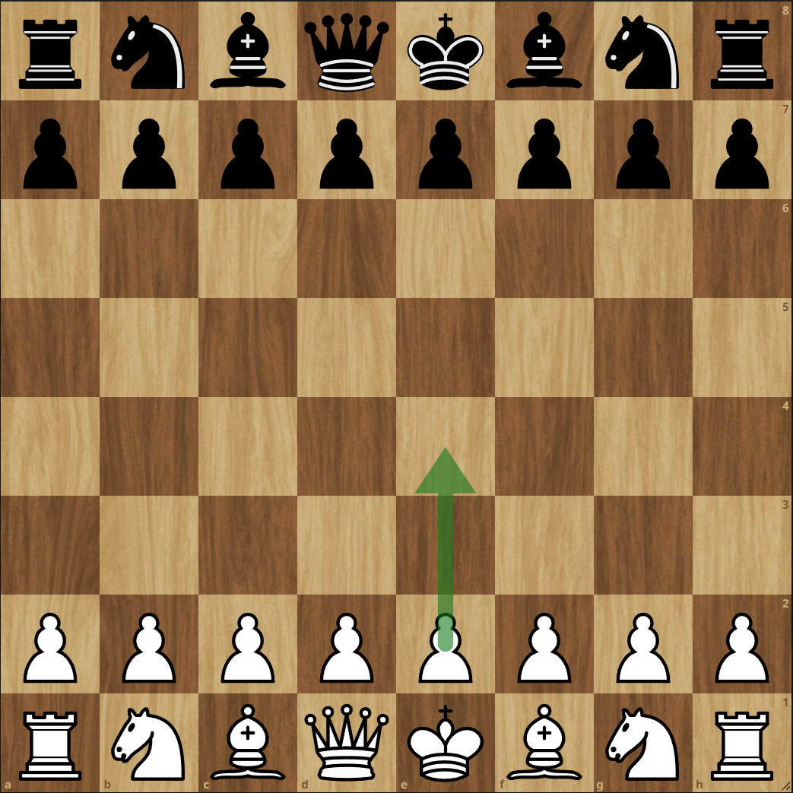
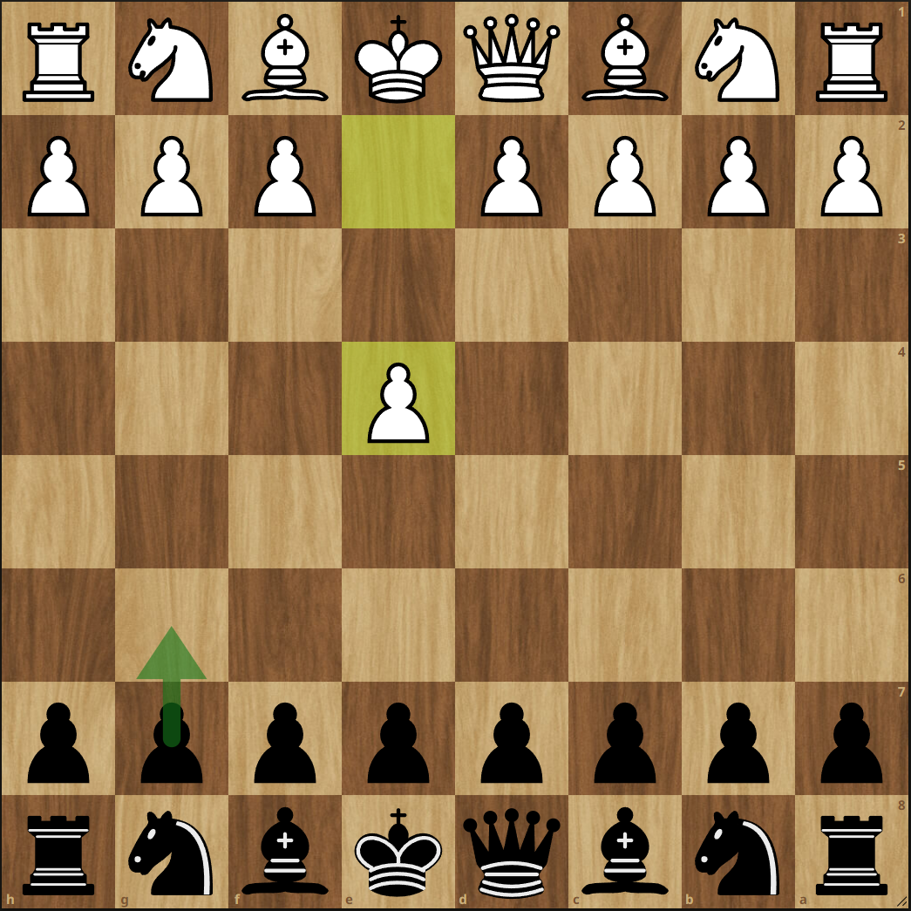

# Trener szachowy (gra dla 2 osób)

Projekt 2 na labolatoria z Programowania Obiektowego

## Ogólny opis projektu

Celem projektu jest stworzenie 2-osobowej gry w szachy, z możliwością bardzo prostego podpowiadania ruchów (na podstawie teorii szachów). Dodatkowo program ma umożliwiać importowanie i eksportowanie pozycji szachowej w [notacji FEN](https://en.wikipedia.org/wiki/Forsyth%E2%80%93Edwards_Notation#Examples)

## Podpowiadanie ruchów

Projekt zakłada zaimplementowanie prymitywnego mechanizmu podpowiadania ruchów, po wybraniu danego otwarcia szachowego (można rozważyć możliwość wyświetlania kilku wariantów na raz), natomiast w przypadku zagrania ruchu niezgodnego z teorią podpowiadanie się wyłącza .

### Przykład 1

Gracz wybiera z listy otwarć opcję 'Gra szkocka':

### Przykład 2

Gracz wybiera z listy otwarć opcję 'Obrona nowoczesna':

## Uwagi

Przy implementacji ruchu poszczególnych figur należy zwrócić szczególną uwagę na aspekty takie jak:

-   Związanie figury
-   Bicie w przelocie
-   [Roszada](https://pl.wikipedia.org/wiki/Roszada)
